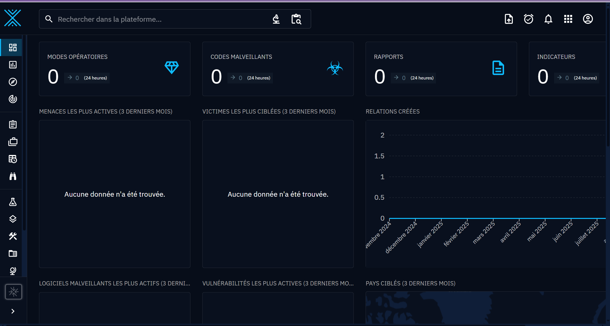

# 🚀 OpenCTI in Docker (GitHub Codespaces Setup)

This guide explains how to deploy **OpenCTI** entirely in **Docker** inside a **GitHub Codespace** for full portability.

---

## 🧱 1. Enable Docker in Your Codespace

Ensure Docker and Docker Compose are available:

```bash
docker --version
docker-compose --version
```

If not, enable Docker support in your Codespace (`Ports` tab → Docker enabled).

---

## 📦 2. Clone the OpenCTI Docker Repository

```bash
mkdir -p ~/opencti && cd ~/opencti
git clone https://github.com/OpenCTI-Platform/docker.git
cd docker
```

---

## ⚙️ 3. Create and Configure Your `.env` File

```bash
cp .env.sample .env
```

Then generate UUIDs and default settings automatically:

```bash
sudo apt install -y jq
(cat << EOF
OPENCTI_ADMIN_EMAIL=admin@opencti.io
OPENCTI_ADMIN_PASSWORD=ChangeMePlease
OPENCTI_ADMIN_TOKEN=$(cat /proc/sys/kernel/random/uuid)
OPENCTI_BASE_URL=http://localhost:8080
OPENCTI_HEALTHCHECK_ACCESS_KEY=$(cat /proc/sys/kernel/random/uuid)
MINIO_ROOT_USER=$(cat /proc/sys/kernel/random/uuid)
MINIO_ROOT_PASSWORD=$(cat /proc/sys/kernel/random/uuid)
RABBITMQ_DEFAULT_USER=guest
RABBITMQ_DEFAULT_PASS=guest
ELASTIC_MEMORY_SIZE=2G
CONNECTOR_HISTORY_ID=$(cat /proc/sys/kernel/random/uuid)
CONNECTOR_EXPORT_FILE_STIX_ID=$(cat /proc/sys/kernel/random/uuid)
CONNECTOR_EXPORT_FILE_CSV_ID=$(cat /proc/sys/kernel/random/uuid)
CONNECTOR_IMPORT_FILE_STIX_ID=$(cat /proc/sys/kernel/random/uuid)
CONNECTOR_EXPORT_FILE_TXT_ID=$(cat /proc/sys/kernel/random/uuid)
CONNECTOR_IMPORT_DOCUMENT_ID=$(cat /proc/sys/kernel/random/uuid)
CONNECTOR_ANALYSIS_ID=$(cat /proc/sys/kernel/random/uuid)
SMTP_HOSTNAME=localhost
EOF
) > .env
```

---

## 🧩 4. Adjust Memory for Elasticsearch

```bash
sudo sysctl -w vm.max_map_count=1048575
```

(Optional: make persistent)

```bash
echo "vm.max_map_count=1048575" | sudo tee -a /etc/sysctl.conf
```

---

## 💾 5. Start Everything with Docker Compose

```bash
docker-compose up -d
```

Check containers:

```bash
docker ps
```

---

## 🌐 6. Access OpenCTI in Codespaces

Expose port **8080** (Public) in Codespaces → open the link provided.

Default credentials:

```
Email: admin@opencti.io
Password: ChangeMePlease
```

---

## 🔄 7. Managing the Stack

| Command                                                   | Description           |
| --------------------------------------------------------- | --------------------- |
| `docker-compose logs -f`                                  | Stream logs           |
| `docker-compose down`                                     | Stop all containers   |
| `docker-compose restart`                                  | Restart all           |
| `docker-compose ps`                                       | List running services |
| `git pull && docker-compose pull && docker-compose up -d` | Update stack          |

---

## 🧰 Optional: Add Connectors or Workers

Add connectors from the `/connectors` directory or external repos.

---

## ✅ Summary

| Step | Action         | Command                                                    |
| ---- | -------------- | ---------------------------------------------------------- |
| 1    | Clone repo     | `git clone https://github.com/OpenCTI-Platform/docker.git` |
| 2    | Create `.env`  | `cp .env.sample .env`                                      |
| 3    | Generate UUIDs | (script above)                                             |
| 4    | Tune VM        | `sudo sysctl -w vm.max_map_count=1048575`                  |
| 5    | Run stack      | `docker-compose up -d`                                     |
| 6    | Access web     | via Codespace port 8080                                    |
| 7    | Default login  | `admin@opencti.io / ChangeMePlease`                        |

---

**Enjoy your fully portable OpenCTI setup inside GitHub Codespaces!**

---

